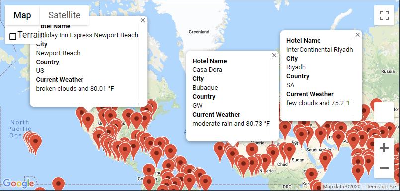

# World Weather Analysis

## Challenge Overview
You are building an app that plans vacation trips. You are given the task to include weather description in addition to the weather data you have gathered. Secondly, you are to implement a way for beta testers to use input statements to filter the data for their weather preferences. From these weather preferences, you will identify potentional travel destinations and nearby hotels. Then, 4 cities will be chosen to create a travel itinerary. You are to create a travel route between the 4 cities as well as a marker layer map.

## Resources
- Data Source: api.openweathermap.org, jupyter-gmaps
- Software: Anaconda 4.8.3, Jupyter Notebook 6.0.3, Python 3.7.7, Visual Studio Code 1.47.2

## Challenge Results

Looking at our WeatherPy_Database.csv, we have gathered the following metrics of city data
- City Name
- Country Code
- Latitude and Longitude
- Max Temperature (°F)
- Humidity (%)
- Cloudiness (%)
- Wind Speed (mph)
- Current Weather Description

Based on a sample weather preference of having temperature being between 75 and 90 Fahrenheit, we have generated a marker layer map with pop-up markers for cities fitting the criteria. Each marker displays hotel name, city name, country code, current weather description and maximum temperature. WeatherPy_vacation.csv is the full list of cities fitting this weather preference with the additional metric of hotel name.

Using the previous WeatherPy_vacation_map.png, we selected 4 cities to create a vacation travel itinerary. We have mapped out the driving route and created a marker layer map with pop-up markers for each of the 4 cities.

## Challenge Summary
One business recommendation would be to increase the amount of drivers in urban cities. This city type is by far the most profiable given its dense population. Increasing the amount of drivers would result in higher total fares. Another recommendation would be to lower fares in suburban cities. Riders might be discouraged from using ride share apps because of the lower population causing higher fares. Lowering fares would encourage more people in suburban cities to use ride share apps. Lastly, another recommendation would be to get rid of ride share for rural cities altogether. Given that the population is so low, there would not be much necessity for rides. Also, the total fares is significantly lower than urban and suburban cities.